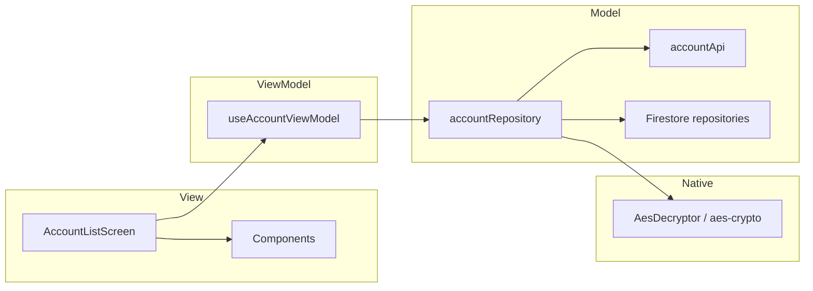
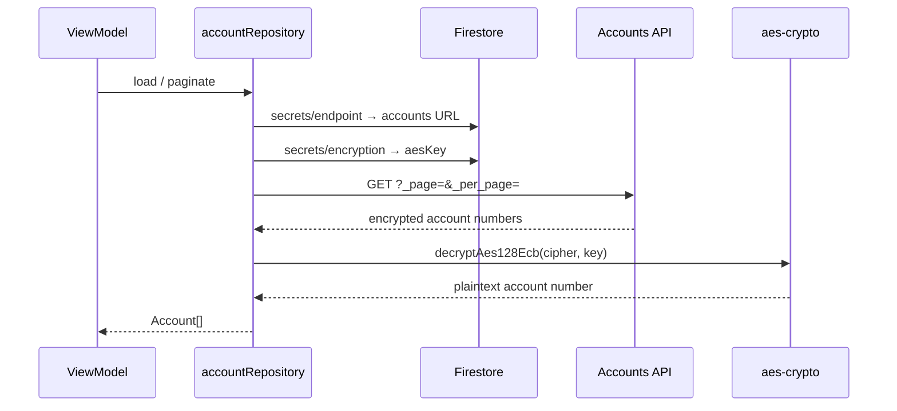
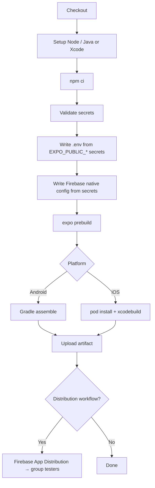

# bankx-coding-assignment

KakaoBank-style mobile banking app built with **React Native (Expo)** for the BankX coding assignment.

The app lists encrypted bank accounts from a remote API, decrypts account numbers via a **native AES module**, and gates sensitive reveal behind **biometrics**. Configuration and secrets are loaded from **Firebase Firestore** at runtime — never hardcoded in source.

---

## Table of contents

- [Overview](#overview)
- [Tech stack](#tech-stack)
- [Repository layout](#repository-layout)
- [Architecture (MVVM)](#architecture-mvvm)
- [Runtime data flow](#runtime-data-flow)
- [Security](#security)
- [CI/CD (GitHub Actions)](#cicd-github-actions)
- [Local development](#local-development)
- [Required secrets](#required-secrets)

---

## Overview

| Area | Detail |
|------|--------|
| App | `KakaoBankApp` — Expo Router, Kakao yellow design system |
| Pattern | **MVVM** per feature under `src/features/` |
| Platforms | iOS + Android (Expo prebuild → native projects in CI) |
| Distribution | GitHub Actions artifacts + Firebase App Distribution |
| Firebase project | `bankx-code-assignment` |

### What the app does

1. Fetches the accounts API base URL from Firestore (`secrets/endpoint`)
2. Fetches the AES key from Firestore (`secrets/encryption`)
3. Loads accounts with pagination (`_page`, `_per_page`)
4. Decrypts account numbers through native crypto (iOS CommonCrypto / Android `javax.crypto`)
5. Reveals full account numbers only after Face ID / fingerprint

---

## Tech stack

| Layer | Choice |
|-------|--------|
| Framework | Expo SDK 57, React Native 0.86, React 19 |
| Routing | Expo Router (file-based, thin `app/` routes) |
| Backend config | Firebase JS SDK → Firestore |
| Storage | Expo Secure Store / AsyncStorage (favorites) |
| Auth (local) | Expo Local Authentication |
| Crypto | Local Expo module `modules/aes-crypto` (no JS crypto libs) |
| Design tokens | `src/core/theme` (Kakao `#FEE500`, warm `#F7F7F7`) |

---

## Repository layout

```text
bankx-coding-assignment/
├── KakaoBankApp/                 # Expo application
│   ├── app/                      # Thin Expo Router routes
│   ├── src/
│   │   ├── core/                 # Shared infra (env, firebase, theme)
│   │   └── features/
│   │       ├── accounts/         # Account list feature (MVVM + native)
│   │       └── navigation/       # Tab bar feature (MVVM)
│   ├── modules/aes-crypto/       # Expo native module (AES-128-ECB)
│   ├── firebase/                 # Native Firebase configs (*never commit real files*)
│   │   ├── *.example             # Placeholders for local/CI docs
│   │   ├── google-services.json  # gitignored — local / CI only
│   │   └── GoogleService-Info.plist
│   └── .env.example
├── .github/
│   ├── actions/github-actions/   # Reusable composite actions
│   └── workflows/                # CI/CD pipelines
└── README.md
```

---

## Architecture (MVVM)

The app follows **Model–View–ViewModel**. UI components are presentational (props in → UI out). Business logic, fetching, and crypto live outside the View layer.

```text
src/features/<feature>/
├── data/                    # Model
│   ├── api/                 # HTTP (accounts API)
│   ├── repositories/        # Firestore, storage, biometrics orchestration
│   └── models/              # Types & static config
├── presentation/            # View + ViewModel
│   ├── hooks/use*ViewModel  # UI state, pagination, side effects
│   ├── components/          # Pure UI (Pressable, tokens from core/theme)
│   └── screens/             # Wire ViewModel → View
└── native/                  # Bridge to Expo native modules (accounts only)
```

### Layer responsibilities

| Layer | Location | Responsibility |
|-------|----------|----------------|
| **Model** | `data/api`, `data/repositories`, `data/models` | Types, fetch, sync, key management |
| **ViewModel** | `presentation/hooks/use*ViewModel.ts` | Screen state, pagination, error banners |
| **View** | `presentation/components`, `presentation/screens` | Render from props/state only |
| **Native** | `native/AesDecryptor` → `modules/aes-crypto` | AES decrypt on iOS/Android |
| **Core** | `src/core/{env,firebase,theme}` | Env helpers, Firestore client, design tokens |

### Rules

- No fetch / decrypt / Firestore calls inside UI components
- Screens call ViewModels; ViewModels call repositories
- AES decrypt **only** via `features/accounts/native/AesDecryptor`
- Colors and spacing **only** from `src/core/theme`
- `app/` routes stay thin — re-export or wire screens



---

## Runtime data flow



1. **Config** — `EXPO_PUBLIC_*` from `.env` / CI secrets (client Firebase config)
2. **Endpoint + AES key** — Firestore at runtime (not bundled as secrets)
3. **Accounts** — paginated REST via FlatList
4. **Decrypt** — native module only
5. **Reveal** — biometric gate before showing full number

---

## Security

| Concern | Approach |
|---------|----------|
| No hardcoded Firebase credentials | `process.env.EXPO_PUBLIC_*` + `src/core/env` |
| Native Firebase config files | gitignored; CI writes from GitHub Secrets |
| AES key | Firestore only — never in `.env` or source |
| Account decrypt | Native CommonCrypto / `javax.crypto` (no JS crypto libs) |
| Errors | Propagate to ViewModel / UI banner — no `Alert.alert` for API errors |
| Favorites | Secure Store / AsyncStorage |

Local Firebase files:

```bash
cp KakaoBankApp/firebase/google-services.json.example \
   KakaoBankApp/firebase/google-services.json
cp KakaoBankApp/firebase/GoogleService-Info.plist.example \
   KakaoBankApp/firebase/GoogleService-Info.plist
# Fill with real values from Firebase Console (do not commit)
```

---

## CI/CD (GitHub Actions)

Pipelines live under `.github/workflows/` and reuse composite actions under `.github/actions/github-actions/`.

### Pipelines

| Workflow | Trigger | Output | Status |
|----------|---------|--------|--------|
| **Android Emulator Build** | `workflow_dispatch`, tag `v*` | Debug/Release APK artifact | Available |
| **iOS Simulator Build** | `workflow_dispatch`, tag `v*` | `.app.tar.gz` simulator artifact | Available (no paid Apple account required) |
| **Firebase App Distribution (Android)** | `workflow_dispatch`, tag `v*` | Release APK → Artifact + Firebase testers | Available |
| **Firebase App Distribution (iOS)** | `workflow_dispatch`, tag `v*` | Signed IPA → Artifact + Firebase testers | **Not runnable yet** — see below |

### Firebase App Distribution (iOS) — current limitation

The **Firebase App Distribution (iOS)** workflow is fully wired in CI (prebuild → CocoaPods → archive → export IPA → upload to Firebase), but it **cannot run successfully right now** because there is **no Apple Developer Program account**.

Shipping a device-installable IPA requires paid Apple signing materials that this project does not have yet:

| Requirement | Why it is needed |
|-------------|------------------|
| Apple Developer Program membership | Issue certificates and provisioning profiles |
| Distribution certificate (`.p12`) | Code-sign the archive (`IOS_DISTRIBUTION_CERTIFICATE_P12` + password) |
| Ad Hoc / Enterprise provisioning profile | Allow install on registered tester devices (`IOS_PROVISIONING_PROFILE`) |
| Team ID | Xcode `DEVELOPMENT_TEAM` (`IOS_TEAM_ID`) |

Without those secrets, the `ios-ipa-build` step fails at signing / export. The workflow YAML and composite action remain in the repo as the intended path once an Apple Developer account is available.

**What works today for iOS**

- **iOS Simulator Build** — builds an unsigned simulator `.app.tar.gz` artifact (no distribution certificate required). Use this for CI verification and local simulator installs.
- **Firebase App Distribution (Android)** — end-to-end APK distribution to the `testers` group.

**When an Apple Developer account is ready**

1. Create an Ad Hoc (or Enterprise) distribution certificate and provisioning profile for `com.bankx.kakaobankapp`
2. Add GitHub Actions secrets: `IOS_TEAM_ID`, `IOS_DISTRIBUTION_CERTIFICATE_P12` (base64), `IOS_DISTRIBUTION_CERTIFICATE_PASSWORD`, `IOS_PROVISIONING_PROFILE` (base64), plus `FIREBASE_IOS_APP_ID` / `FIREBASE_SERVICE_ACCOUNT_JSON`
3. Re-run **Firebase App Distribution (iOS)** via `workflow_dispatch` or a `v*` tag

### Shared build flow



### Composite actions

| Action | Role |
|--------|------|
| `write-firebase-native-config` | Materialize `google-services.json` / `GoogleService-Info.plist` from secrets |
| `android-build` | Resolve Expo Android layout, `./gradlew assemble*`, upload APK |
| `ios-build` | Resolve CocoaPods workspace, simulator `xcodebuild`, upload `.app.tar.gz` |
| `ios-ipa-build` | Import signing material, archive, export IPA |

### Download artifacts

```bash
gh run list --workflow "Android Emulator Build" --limit 5
gh run download <run-id> -n <artifact-name> -D ./artifacts

gh run list --workflow "iOS Simulator Build" --limit 5
gh run download <run-id> -n <artifact-name> -D ./artifacts
```

---

## Local development

```bash
cd KakaoBankApp
cp .env.example .env
# Fill EXPO_PUBLIC_* values

cp firebase/google-services.json.example firebase/google-services.json
cp firebase/GoogleService-Info.plist.example firebase/GoogleService-Info.plist
# Fill real Firebase native config

npm install
npx expo start -c
```

Useful scripts:

| Script | Purpose |
|--------|---------|
| `npm start` | Expo dev server |
| `npm run android` / `ios` | Open platform |
| `npm run prebuild:android` / `prebuild:ios` | Generate native projects locally |
| `npm run build:android:apk` | Prebuild + Release APK |

Mock accounts API (sibling json-server, if present):

```bash
npm run mock-server:install
npm run mock-server
```

---

## Required secrets

### App / Expo (all build workflows)

- `EXPO_PUBLIC_FIREBASE_API_KEY`
- `EXPO_PUBLIC_FIREBASE_AUTH_DOMAIN`
- `EXPO_PUBLIC_FIREBASE_PROJECT_ID`
- `EXPO_PUBLIC_FIREBASE_STORAGE_BUCKET`
- `EXPO_PUBLIC_FIREBASE_MESSAGING_SENDER_ID`
- `EXPO_PUBLIC_FIREBASE_APP_ID`
- `EXPO_PUBLIC_FIRESTORE_SECRET_COLLECTION`
- `EXPO_PUBLIC_FIRESTORE_SECRET_DOCUMENT`
- `EXPO_PUBLIC_FIRESTORE_SECRET_FIELD`

### Firebase native configs (never commit real files)

```bash
gh secret set FIREBASE_GOOGLE_SERVICES_JSON < KakaoBankApp/firebase/google-services.json
gh secret set FIREBASE_GOOGLE_SERVICE_INFO_PLIST < KakaoBankApp/firebase/GoogleService-Info.plist
```

### Firebase App Distribution

- `FIREBASE_SERVICE_ACCOUNT_JSON`
- `FIREBASE_ANDROID_APP_ID` / `FIREBASE_IOS_APP_ID`
- Tester group: **`testers`**

### iOS signing (IPA / Firebase App Distribution iOS only)

> **Blocked until an Apple Developer Program account is available.**  
> These secrets are required by `Firebase App Distribution (iOS)` but are not configured yet, so that workflow is documented above as not runnable. Use **iOS Simulator Build** for CI iOS artifacts in the meantime.

- `IOS_TEAM_ID`
- `IOS_DISTRIBUTION_CERTIFICATE_P12` (base64)
- `IOS_DISTRIBUTION_CERTIFICATE_PASSWORD`
- `IOS_PROVISIONING_PROFILE` (base64)

---

## Design notes

- Accent: Kakao yellow `#FEE500`
- Background: warm light `#F7F7F7`
- Interactive surfaces use `Pressable` with tactile feedback
- Lists use `FlatList` pagination — no blank loading screens (skeleton / loading state)

---

## License

Private coding assignment repository.
